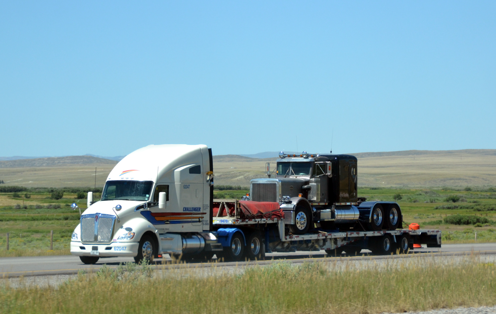

# Go to Trucker

Это пятничный пост, фантазия на тему. Илон Маск говорил, что необязательно всю жизнь сидеть кодером. Но мечта должна оставаться мечтой, иначе мечты не будет. И всё же, я исследовал и примерил свою давнюю мечту.

## Америка

Я задумался переехать в США после Армии в 1991-ом. Но решил подготовиться, чтобы начинать там не посудомойкой, а с профессией и языком. Прошло 32 года - Unclosed Gestalt.

[Евгений Таранов](https://www.youtube.com/@evgen.taranov) (или "Таран", простой сисадмин из Тольятти) переехал по Гринкарте в 2018-ом. Предыдущие жильцы моей минской квартиры получили Гринкарту в 2018-ом. Я тоже столкнулся с продажей питерской квартиры в 2018-ом, но почему-то продолжаю страдать в попытках поиска своего места: 3 недоделанных стартапа, больше сотни собесов, 3 провальные попытки выхода на работу в среднем по 3 месяца. А запись на очередную Гринкарту начинается 5 октября.

Не было счастья, да несчастье помогло. Из-за лавины эмигрантов, случилось следующее: повсеместно открыты [шелтеры](https://www.youtube.com/watch?v=PIS4f71w4t4) и фудбанки; появилось [приложение CBP ONE](https://www.youtube.com/watch?v=B5vdMtHVhUc), которое работает с 17 января.

На заметку: [паралигал](https://www.youtube.com/watch?v=BovAMNidrsw&t=1789s) в два раза дешевле адвоката, чтобы оказать вам услугу по политическому кейсу.

## Дальнобой

Собирался объехать всю Америку от берега до берега ровно 10 лет тому назад. Теракт в Бостоне совпал с интервью в посольстве. Купил листик A4 за $160 с отказом на туристическую визу.

Если в компьютерные игры, то мне интересно с рулём. Страшно подумать, сколько "проехал" по молодости. Потом дорвался, полгода приключений ночным бомбилой по Питеру в 2003-ем. Лучше не вспоминать. Было несколько эпизодов, когда чуть-чуть не убили.

На маленьком дизельном кроссовере исколесил всю Европу от Нордкапа до Олимпа. Плюс арендный автодом и два своих кемпера. Наберётся больше года походных ночёвок. Бродяга со стажем, мне это нравится, очевидно.

Свалить куда-либо вообще - как путешествие на Луну. Прожить ещё одну жизнь, и [на 16 лет больше](https://m-ivanov.com/old/2017/01/statisticheski-vy-vyigryvaete-biznesmen-mixail-ivanov-o-zhizni-v-ssha/). Позалипать на виды из окна и зачекиниться на локациях. Получше, чем Ютуб на диване, тем более, что в рейсе точно так же в планшет одним глазом.

А все свои стартапы в режиме [live-code](https://www.youtube.com/akaassa73) можно продолжать пилить на стоянках перед сном, покрытие 5G повсеместное. Жены у меня нет давно. Куда девать котиков. Начинать тренировать-выгуливать. И учить английскому.

Кстати, отсутствие английского - это не такая большая проблема, с клиентами общается диспетчер из Казахстана, совмещая роль переводчика.

## Документы

[Какие виды SSN](https://www.youtube.com/watch?v=5yyP91677yk)

- для граждан и держателей Green Card, а это плюс маршруты в Канаду
- разрешение на работу от DHS (Department Homeland Security)
- non-work SSN (чтобы получать бенефиты, но можно работать "на чек")

CDL - лицензия для Semi Track. Учиться надо от двух недель до двух месяцев. $2500 - школа, $350 - экзамен за каждую попытку. Такие цены сейчас в штате Филадельфия. Нормально сдают с нулевым уровнем английского, так что не стоит отнекиваться по этому поводу. Нужен SSN & Work Authorization. [Приложение для подготовки на экзамен](https://driving-tests.org/dmv-genie/).

HAZMAT / TANK - лицензия на опасные грузы. Больше платят и меньше суеты, но риски под большим вопросом.

## С чего начинать

Pickup Truck DodgeRam 3500, который не требует CDL, плюс полуприцеп "троечка" под перевозку 3-х легковых машин на открытой платформе. Если на дядю, то это 30% от gross 8-10 килобаксов в неделю. Сломался трак - не моя проблема, пересел на другой без простоя. Внутри снимаются пассажирские кресла, а вместо них матрас. Но качество сна ниже плинтуса, когда без кондея-обогрева и в малом объёме воздуха. Я пробовал бомжевать в кроссовере 4 месяца подряд напротив резиденции американского посла на Старом Арбате.

Ну ладно. В найме на Semi Track + Reefer можно кататься по 0,65 доллара за милю. А это 2-3 килобакса в неделю, в нынешних условиях плохого рынка. Гораздо более лучше, чем лидом в СБЕРе. Для наёмного сотрудника выгоднее кататься на "длинные мили".

Программа максимум. Собственный Semi Track Kenworth T680 + Step Deck 53'. Это 36 килобаксов в месяц чистыми. [Таран отчитался год назад](https://youtu.be/4yC4sjoKvAU?si=olJQ9UOI5KWgIyhM), сейчас должно быть похуже. И больно смотреть, как он надрывается, когда крепит грузы в жару за 40 градусов.

А что дальше? Владелец трака ("truck owner"). [Братишка Сисун](https://www.youtube.com/@BroSeesoon/videos) на сегодня обладает парком из 38 траков.

## Оптимальное соотношение цена-качество

Pickup Truck DodgeRam 3500 стоит до $70K, Semi Track Kenworth T680 стоит до $200K. Плюс полуприцеп в аренду или тоже свой. На старте не получить кредит - на помощь приходит [Credit Booster](https://www.youtube.com/@iamalexbloom).

Экзотика [ARI Legacy Sleepers](https://www.legacysleepers.com/) - сомнительная затея. Возить с собой будку за лишних $100K ради кухни-душа-туалета. Ну такое. Бытовые вопросы закрывают стоянки (т.н. "truck stop" / "travel center") и штатный слипер любого американского Semi Truck. А в Kenworth T680 есть штатное поворотное пассажирское кресло, что превращает грузовик в рабочее место погромиста.

На заметку: как обходить стороной общественные туалеты. В приложении [Pilot Flying J](https://www.youtube.com/watch?v=79jiXyRsLvc), когда заправляешь на 1000 галонов в месяц, есть опция "shower-power" - безлимитный душ на месяц. Заранее бронируешь по маршруту.

## Варианты сцепки на Semi Track

**Car hauler**. "Элита дальнобоя" [Kentucky Trailer XL-12](<https://www.kytrailer.com/Specialty-Trailers/Category/2/Enclosed-Auto-Vehicle-Transport/Type/45/XL-12-(6-7)-Car>) - закрытый автовоз для лухарей, полуприцеп с лифтами на 6-7 машин. Ещё $200K за новый, а б/у под большим вопросом. Проблемы с загрузкой-разгрузкой, плюс требуется английский для общения с частными клиентами. Ну хорошо. У меня было штук 10 автоклубов, ловил низкочастотный трафик. И на каждом я самый активный участник. Безумие. Допустим, что наигрался в абстрактные машинки. Но сесть за руль реальной Феррари - и это такая работа?

Ещё про [плюсы-минусы на автовозе](https://www.youtube.com/watch?v=KJ97LupzUBs)
Ещё про [Boydstun Stinger Peterbilt](https://www.youtube.com/watch?v=E7ceff983uQ)

**Dry Van** / **Reefer**. Закрытый полуприцеп для защиты грузов от воздействия внешней среды. Сейчас упали тарифы, а [мутные замуты](https://www.youtube.com/watch?v=cHdqmVv8j5w) мне точно не нужны. Кататься от одной логистической базы до другой - это плюс или минус? Не паришься о загрузке-разгрузке, что на жаре актуально буквально. Но процесс может затягиваться до 8-12 часов (хотя HAZMAT грузят быстро). Если полуприцеп с холодильником, то идёт доплата. Только как с этим грохотом жить - непонятно.

**Flatbed**. Сплошная алюминиевая платформа на уровне сцепки. Самый лёгкий, но высоковато. Теряешь в универсальности грузогабарита.

**Step Deck**. Более низкая платформа со ступенькой наверх для сцепки. А если нужна максимально длинная плоскость, то рампы ставятся на ребро. Размер имеет значение: [48 VS 53 фута](https://www.youtube.com/watch?v=XoFdP45xqJA) - маневренность или универсальность. Тяжелее, чем Flatbed, т.к. частично стальная конструкция платформы.

**Lowboy**. Полуприцеп с двумя перепадами высоты палубы: один сразу после гусака, другой - перед колёсами. Самый тяжёлый и грузоподъёмный для неспешного перемещения с жёлтыми табличками "OVERSIZE LOAD" и проблесковыми маячками. Красота!

**Conestoga** - опциональная [штора](https://www.youtube.com/watch?v=rwTgje6Pyg8) для открытых прицепов. Снимает проблему с тарповкой (упражнения с брезентом), но добавляет лишний вес плюс парус, и не загрузишь оверсайз. В итоге грузов значительно меньше, потому как брокера не хотят брать ответственность за повреждения конструкции шторы.

[Tanker Truck Driving Jobs](https://www.smart-trucking.com/tanker-truck-driving-jobs/)
[Сравнение заработной платы водителя танкера и водителя бортовой платформы](https://www.youtube.com/watch?v=yeWKyG2Tiaw)
[HOW TO GET A TANKER JOB WITH NO EXPERIENCE (TIPS)](https://www.youtube.com/watch?v=_QB7K0uAGwM)

Таран выбрал Kenworth T680 + Step Deck 53'

Дополнительно:

- [Как Safety Rating влияет на прибыль компании](https://dispatch42.school/blog/kak-safety-rating-vliaet-na-pribil-kompanii)
- [Налоги для владельца truck бизнеса в США](https://dispatch42.school/blog/nalogi-dlea-vladelta-truck-biznesa-v-usa)
- [Использование автомобиля для ведения коммерческой деятельности](https://www.irs.gov/ru/taxtopics/tc510)
- [Кастомные кресла для больной спины](https://www.seatsinc.com/products/on-highway/)

---

Понятно, что Таран пашет, как лошадь. И можно возразить, что не всем так повезло. Но если [у неё получилось](https://www.youtube.com/watch?v=V949NALgt_4), то как-то стыдно сомневаться в своих силах.

	
Спросил у ChatGPT: мечта на бумаге превращается в реальность?

Мечта, оформленная на бумаге, может стать первым шагом к её осуществлению. Написание цели или мечты на бумаге помогает прояснить свои мысли, установить ясные направления и действия, которые нужно предпринять для её достижения. Однако, чтобы мечта стала реальностью, требуется ещё много работы, самодисциплины, настойчивости и возможно, даже корректировки и адаптации планов по ходу дела. Важно помнить, что реализация мечты зависит от множества факторов, включая ваши усилия, везение, поддержку окружающих и внешние обстоятельства.

